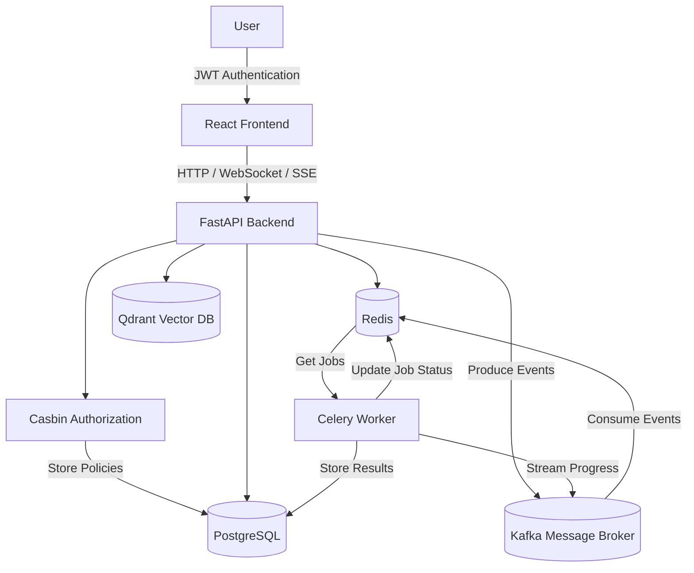
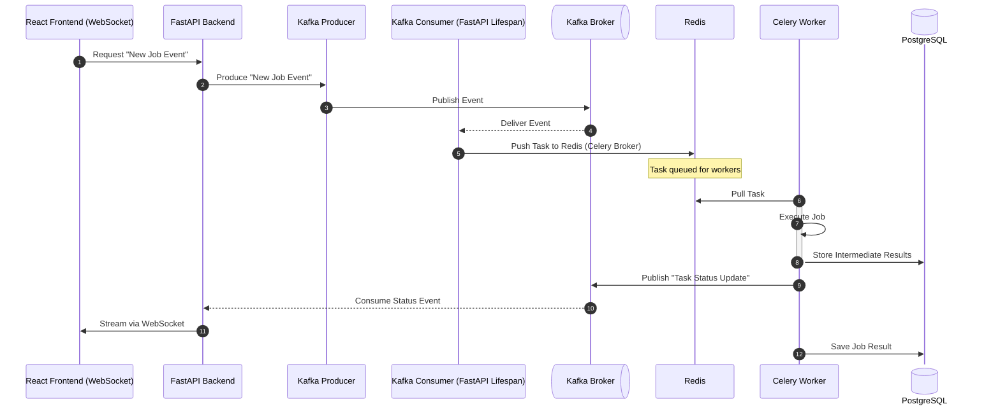

# TRON - Temporal Reasoning & Orchestration Neuron

## System Architecture



### Event Driven Flow



## FastAPI Backend

### Installation

Install [UV](https://docs.astral.sh/uv/) - Rust based python package manager

```bash
curl -LsSf https://astral.sh/uv/install.sh | sh
```

#### Create Virtual Environment for Python using UV

```bash
uv venv
source .venv/bin/activate
```

#### Install dependencies

```bash
uv sync
```

#### Dependencies

| Package                                              | Description            |
| ---------------------------------------------------- | ---------------------- |
| [Alembic](https://alembic.sqlalchemy.org/en/latest/) | Database Migration     |
| [Celery](https://docs.celeryq.dev/en/stable/)        | Background Worker      |
| [QDrant](https://qdrant.tech/documentation/)         | Vector Search Engine   |
| [Casbin](https://casbin.org/docs/get-started/)       | Access Control Library |

### Managing Migrations using Alembic

To create new migration

```bash
uv run alembic revision --autogenerate -m "add user table"
```

To run your migrations

```bash
uv run alembic upgrade head
```

To check migration history

```bash
uv run alembic history --verbose
```

To downgrade to beginning

```bash
uv run alembic downgrade base
```

### Development / Debug

### Qdrant

| Package         | Description                     |
| --------------- | ------------------------------- |
| Qdrant          | http://localhost:6333/dashboard |
| Redis Commander | http://localhost:8082/          |
| PG Admin        | http://localhost:5050/          |
| Adminer         | http://localhost:8080/          |
| Kafbat UI       | http://localhost:8081/          |
| Celery Flower   | http://localhost:5555/          |

### App Management CLI

```bash
python -m src.cli.manage --help
```

```bash

Usage: python -m src.cli.manage [OPTIONS] COMMAND [ARGS]...

 App Management CLI

╭─ Options ──────────────────────────────────────────────────────────────────────────────────────────────────────╮
│ --install-completion          Install completion for the current shell.                                        │
│ --show-completion             Show completion for the current shell, to copy it or customize the installation. │
│ --help                        Show this message and exit.                                                      │
╰────────────────────────────────────────────────────────────────────────────────────────────────────────────────╯
╭─ Commands ─────────────────────────────────────────────────────────────────────────────────────────────────────╮
│ users     User Management CLI                                                                                  │
│ seeders   Seeder CLI                                                                                           │
╰────────────────────────────────────────────────────────────────────────────────────────────────────────────────╯
```
